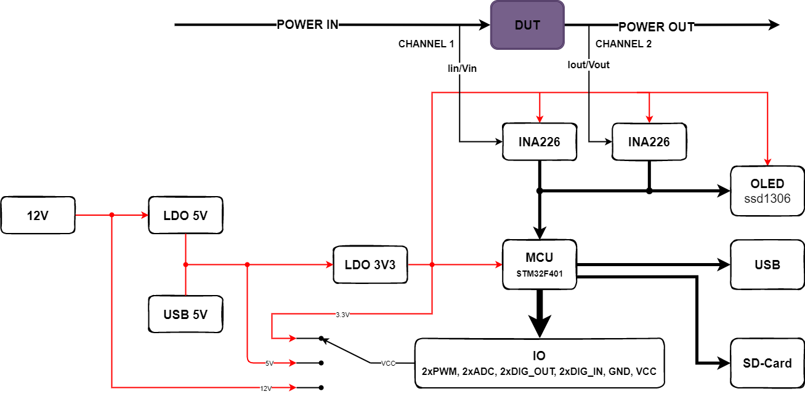

# REMDx
The REMDx can measure 0-35V DC voltages with a resolution of 1mV, 0-8A DC currents with a resolution of 250uA (which can be modified), burden voltages, and power. Furthermore, all measurements can be performed over two channels.
The REMDx (Realtime Efficiency Measurement Unit x) was originally intended to measure effeciency of Switch Mode Power Supplies hence the name REMDx, but later evolved to a datalogging device.

The REMDx is capable of measuring:
- 2 channel votlage measurement 0-35V with resolution of approximately 1mV
- 2 channel current measurement 0-8A  with resolution of approximately 250uA
- 2 channel power measurent
- 2 channel burden voltage measurent

