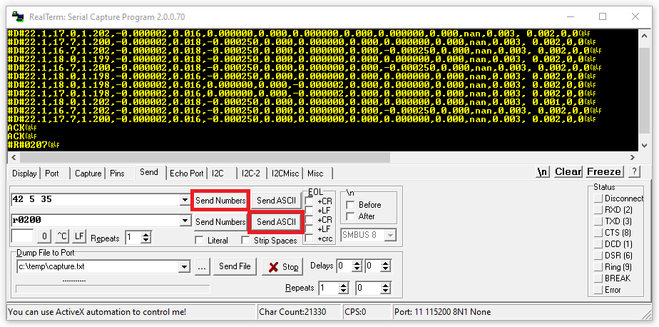
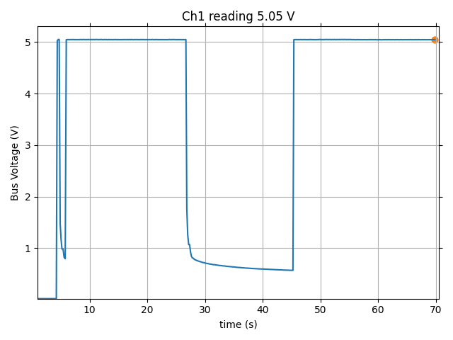

<h1 align = "center">REMDx</h1>

REMDx is a board that is able to measure **0-35V DC voltage** with a resolution of 1mV, **0-8A DC current** with a resolution of 250uA (which can be changed by replacing the shunt resistor), **burden voltage**, and **power**. Furthermore, all measurements can be performed over two channels.
The REMDx (Realtime Efficiency Measurement Unit x) was originally intended to measure effeciency of Switch Mode Power Supplies / Linear Regulator hence the name REMDx, but later evolved to a datalogging device. See the [schematic](https://github.com/quractech/remdx/blob/main/remd_scheamtic.pdf) of REMDx.

System block diagram of the REMDx is shown below.

The REMDx PCB


## Capability

The REMDx is capable of measuring:

- 2 channel voltage measurement 0-35V with resolution of approximately 1mV
- 2 channel current measurement 0-8A with resolution of approximately 250uA, coms with 10mOhm shunt resistor.
- 2 channel power measurent
- 2 channel burden voltage measurent

### J9 CONNECTOR PINOUT

- 4 Digital input pins max. 3.3V (INTx - interrupt pins)
- 2 Analog input pins max 3.3V (MCU ADC with 12bit)
- 2 Digital output pins with selectable output voltage level (3.3V, 5V, and 12V)
- 2 PWM pins with selectable output voltage level (3.3V, 5V, and 12V)

### SD-card

Micro-SDcard slot for saving stream data (stream data is serial data from USB).

### Real-time plotting with python

Data stream capability using USB for datalogging and visualization with python (see scripting folder)

## Getting Started

### **Upgrading REMDx to the most recent firmware**

1. Download and install [STM32CubeProgrammer](https://www.st.com/en/development-tools/stm32cubeprog.html)<br>
   
2. Connect REMDx to you PC with a USB cable that is capable of data transfer.
3. On REMDx press and hold the BOOT button, then press RESET button and let go of both buttons. This will put REMDx in programming mode.
4. Open STM32CubeProgrammer select **USB** (Blue dropdown menu on the right column), then click **refresh** icon until "USB1" shows up on port (Serial number 2081325A4146), then click **connect**.<br> 
5. Download [FW.elf](https://github.com/quractech/remdx/blob/main/FW/Debug/FW.elf) file to your PC. Go back to STM32CubeProgrammer press "open file" then press download. Now REMDx should be programmed or updated to the newest firmware.

### **Get REMDx to Communicate**

7. Download and install [Realterm](https://realterm.sourceforge.io/index.html#downloads_Download) or similar terminal program.<br>
   
8. Select the COMPORT, find it under Device Manager in windows<br> 
9. Select the BAUD RATE 115200 and connect, now you should see a contineous data stream as show in the picture below.<br>
   

### **Register Map**

REMDx can be configured using [register map](https://quractech.github.io/remdx_registermap/), the configuration can be saved in EEPROM (default configuration can be restored).

**COMMUNICATION PROTOCOL**<br>
The REMDx should be written to as follows:<br>

1. A check command **"\* L #"** of 5 bytes ("" are not part of the command) are sent to the device as **numbers**. Where L is the length of the command sent next (L is always 5).<br>
2. To write to or read from the device, a second command of 5 bytes in **ASCII** is sent. <br>


The check command (step 1) must first be successfully received before the second command (step 2) may be sent.<br>
The second command is referred to as "the command" from this point on.<br>

- Byte 1: Indicate the command to read or write
- Byte 2 and 3: Specify the register you are writing to or reading from (32 registers are available for read or write operation).<br>
- Byte 4 and 5: Specify the data you are writing to the device. When reading from a register, ignore these two bytes and set them to 0.

To indicate register data to and from the device, hexadecimal numbers are utilized.
<br><br>
Use the letter **"w"** as the initial character of the command you are sending to the device if you want to **write** to a specific register.<br>

### **Write and Read Example**

Connect REMDx to your PC and open RealTerm.<br>
To stop stream data from REMDx, set the **_meas_mode_** bit to 0, see [register map](https://quractech.github.io/remdx_registermap/)<br>

```bash
[Stop stream data]
w0304
```

```bash
[Writing 0x07 to register 2]
w0207
```

w - to specify a write command<br>
02 - register number 2 as hex value<br>
07 - data writtin to register 2 as hex value.<br>
Relating to the register map:<br>
**_set_led1_=1**<br>
**_set_led2_=1**<br>
as a result of this command the onboard LEDs should turn on
<br>

Use the letter **"r"** as the initial character of the command you are sending to the device if you want to **read** from a specific register.
<br>

```bash
[Reading the content of register 2]
r0200
```

r - to specify a read command<br>
02 - register number 2 as hex value<br>
00 - Not important when reading a register.<br>
Outcome of RealTerm<br>


### **Python scripting**

Live data visualization and REMDx reconfiguration are also possible with Python scripting. <br>
Here is some sample code to turn on led1 and led2.

```python
from datacontrol import dataCTRLMaster
from plotcontrol import plotMaster
remd = dataCTRLMaster()

# LED Example
print(f"set_led1 = {remd.set_led1}")
remd.set_led1 = 1
print(f"set_led1 = {remd.set_led1}")
print(f"set_led2 = {remd.set_led2}")
remd.set_led2 = 1
print(f"set_led2 = {remd.set_led2}")
```

Example code for live plot of bus voltage of channel1.

```python
from datacontrol import dataCTRLMaster
from plotcontrol import plotMaster
remd = dataCTRLMaster()

# Example - Live plot of the bus voltage of channel 1
plotter.plotData(1)
```



