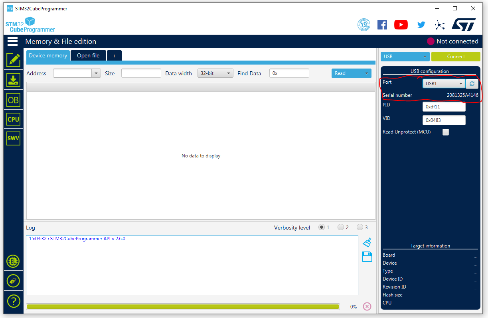

The REMDx a board that is able to measure 0-35V DC voltage with a resolution of 1mV, 0-8A DC current with a resolution of 250uA (which can be modified), burden voltage, and power. Furthermore, all measurements can be performed over two channels.
The REMDx (Realtime Efficiency Measurement Unit x) was originally intended to measure effeciency of Switch Mode Power Supplies / Linear Regulator hence the name REMDx, but later evolved to a datalogging device.

Concept diagram of REMDx is shown below.

The REMDx PCB

## Capability
The REMDx is capable of measuring:
- 2 channel voltage measurement 0-35V with resolution of approximately 1mV
- 2 channel current measurement 0-8A  with resolution of approximately 250uA, coms with 10mOhm shunt resistor.
- 2 channel power measurent
- 2 channel burden voltage measurent
### PINOUT
J9 connect
- 4 Digital input pins max. 3.3V (INTx - interrupt pins)
- 2 Analog input pins max 3.3V (MCU ADC with 12bit)
- 2 Digital output pins with selectable output voltage level (3.3V, 5V, and 12V)
- 2 PWM pins with selectable output voltage level (3.3V, 5V, and 12V)

### SD-card
Micro-SDcard slot for saving stream data (stream data is serial data from USB).
### Real-time plotting with python
Data stream capability using USB for datalogging and visualization with python (see scripting folder)
### Register Map
REMDx can be configured using [register map](https://quractech.github.io/remdx_registermap/), the configuration can be saved in EEPROM (default configuration can be restored).

## Getting Started
1. Download and install [STM32CubeProgrammer](https://www.st.com/en/development-tools/stm32cubeprog.html) 
2. Connect REMDx to you PC with a USB cable that is capable of data transfer.
3. On REMDx press and hold the BOOT button, then press RESET button and let go of both buttons.
4. Open STM32CubeProgrammer select USB (Blue dropdown menu), then press refresh untill "USB1" shows up on port (Serial number 2081325A4146), then connect. 
5. Download and install [Realterm](https://realterm.sourceforge.io/index.html#downloads_Download) or similar terminal program. 
6. Select the COMPORT, find it under Device Manager in windows 
7. Select the BAUD RATE 115200 and connect, now you should see a contineous data stream as show in the picture below. 

